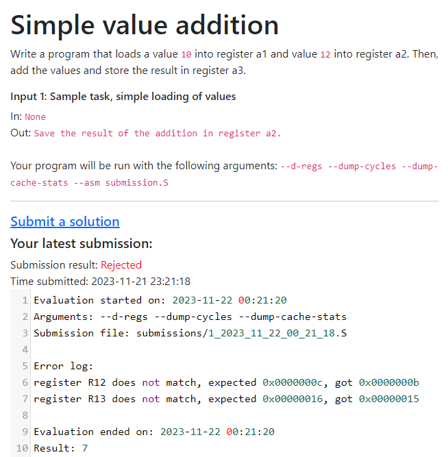

# QtRVSim online evaluation

The app will be written in Flask and will be using a MySQL database.

## Roadmap:
- [x] Users are able to register
- [x] Users are able to login
- [x] List of tasks is displayed on the homepage
- [x] Tasks are displayed on their separate pages which the homepage links to
- [x] Logged in users are able to submit solutions on the submit page (with the task number)
- [x] The submission form has a textarea for the task solution (library CodeMirror for assembly highlighting)
- [x] After submitting, the file will be saved in a folder, and a new record will be created in the submission table
- [x] A file will be evaluated and the submission closed, results will be saved in results file
- [x] The results will be displayed on the submission page
- [x] Automatic evaluator, which periodically checks for new submissions and evaluates them
- [x] Find a way to compare the output to the expected output
- [x] Evaluator compares the task output to the reference
- [x] Comparison of reference registers and submission registers
- [ ] Comparison of reference memory and submission memory
- [x] On each task page, a leaderboard will be shown with the users best submissions (in cycles), made by a request (to the submissions table) for that task
- [x] Each user will only have the latest submission listed

## Database structure (subject to change):

### Users table
| Field              | Type    | Length | Default        |
|--------------------|---------|--------|----------------|
| id                 | int     | 32     | AUTO_INCREMENT |
| username           | varchar | 128    | None           |
| password           | varchar | 128    | None           |
| salt               | varchar | 128    | None           |

### Submissions table

| Field        | Type       | Length | Default             |
|--------------|------------|--------|---------------------|
| id           | int        | 64     | AUTO_INCREMENT      |
| userid       | int        | 64     | None                |
| taskid       | int        | 64     | None                |
| filepath     | varchar    | 64     | None                |
| evaluated    | tinyint    | 1      | 0                   |
| result       | smallint   | 2      | -1                  |
| result_file  | varchar    | 64     | NULL                |
| score        | int        | 32     | -1                  |
| time         | datetime   | None   | current_timestamp() |

User submits a task -> a submission is created. An evaluator evaluates the tasks in the order they came in the database.
After a task is evaluated, it is marked as evaluated, so it is not evaluated more than one time. An evaluation log is created.

### Tasks table

| Field     | Type    | Length | Default        |
|-----------|---------|--------|----------------|
| id        | int     | 64     | AUTO_INCREMENT |
| name      | varchar | 64     | None           |
| path      | varchar | 256    | None           |
| available | tinyint | 1      | 1              |

~~Database are currently running on local XAMPP server, will be migrated to a VPS when possible.~~

Database is running on a remote VPS (omega.swpelc.eu, 158.101.208.70:3306)
Testing app is running on the same server on port 5000 [here](http://omega.swpelc.eu:5000). 

## Task creation
Tasks will be stored in toml format, with structure similar to this one (subject to change):

```toml
[task]
name = "Sample task"

description = '''
# Simple value addition

Write a program that loads a value `10` into register a1 and value `12` into register a2.
Then, add the values and store the result in register a3.
'''

[arguments]
run = "--d-regs --dump-cycles --dump-cache-stats"

[[inputs]]
data_in = "None"
data_out = "Save the result of the addition in register a2."
description = "Sample task, simple loading of values"

[[testcases]]
description = "Test setting of values to register a0 and a1"
do_compare_registers = true
[[testcases.reference_regs]]
R11 = "0x0000000a"
R12 = "0x0000000c"


[[testcases]]
description = "Test addition of values in register a0 and a1, and storing the result in register a2"
do_compare_registers = true
[[testcases.reference_regs]]
R13 = "0x00000016"

[score]
description = "Here, score the task based on some metric."
metric = "cycles"
```
Arguments are passed to the `QtRVSim` object, which is used to run the simulator.

Inputs is an array, that will be printed to users. Here, you can specify sample data, which the user can test their program on.

Testcases is the crucial part of the evaluation. This needs to be set correctly.
In each of the testcases a flag can be set, whether to compare register (or memory, ...), as well as a dictionary, which specific registers (or memory adresses) to compare. In this sample task file, we can see that there are two tests, each testing certain register values.

These are the flags and values that can be set:
```toml
do_compare_registers = true
do_compare_memory_ranges = true

[[testcases.reference_regs]]
R11 = "0x0000000a"
R12 = "0x0000000c"

[[testcases.reference_memory_ranges]]
#this has yet to be implemented
```

After all necessary tests a score test will be run. This is a "test", which measures the final result based on a metric we provide. Metrics that can be provided as of now are:
```toml
metric = "cycles"
metric = "cache"
```
Note that, in order to use the cache metric, the simulator needs to be run with the `--dump-cache-stats` argument. To use the cycles metric, the simulator needs to be run with the `--dump-cycles` argument.

The scoring metrics are handled at the end of `qtrvsim.py` file.

If you need to run a manual evaluation, you can do so by using the `QtRVSim` class from the `qtrvsim.py` file in a following way:
```python
from qtrvsim import QtRVSim

sim = QtRVSim(args="--d-regs --dump-cycles --dump-cache-stats", submission_file="submission.S")
sim.do_compare_registers = True
reference_regs = {
	'R11' : '0x0000000a',
	'R12' : '0x0000000c',
	'R13' : '0x00000016',
}
sim.set_reference_regs(reference_regs)
sim.run()

print(sim.get_log())
print(sim.get_result())
print(sim.get_score())
```

## Task evaluation log
~~The task evaluation log will be stored in a JSON file, with structure similar to this one (subject to change):~~

The log is saved as a plaintext .log file, and is shown to the user. Each log file name is of this format: `username_taskid.log`. (this means that new submission's log overwrites the old one). This file is displayed to the user in this way:



## Database config
Database configuration is made in a file `db_connect.py`
```python
db_config = {
	'user': 'username',
	'password': 'password',
	'host': 'ip',
	'database': 'db_name',
	'port': 3306
}
```

## Acknowledgements
- [Flask](https://flask.palletsprojects.com/en/3.0.x/)
- [CodeMirror](https://codemirror.net/)
- [Bootstrap](https://getbootstrap.com/)
- [QtRVSim](https://github.com/cvut/qtrvsim)
