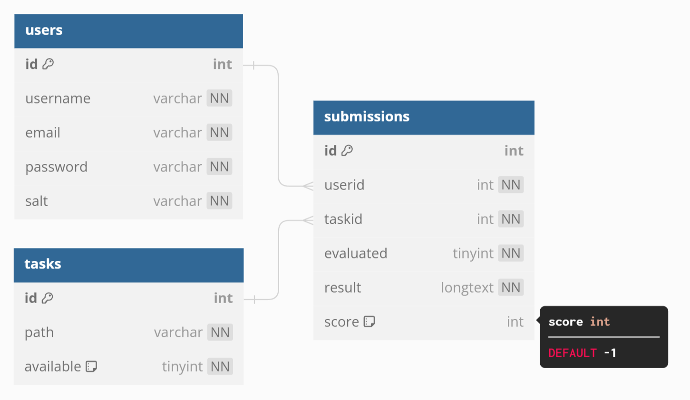

# QtRVSim online evaluation

The app will be written in Flask and will be using a MySQL database.

## Roadmap:
- [ ] Users are able to register
- [ ] Users are able to login
- [ ] List of tasks is displayed on the homepage
- [ ] Tasks are displayed on their separate pages which the homepage links to
- [ ] Logged in users are able to submit solutions on the submit page (with the task number)
- [ ] The submission form has a textarea for the task solution
- [ ] After submitting, the file will be saved in a folder, and a new record will be created in the submission table
- [ ] A file will be evaluated and the submission closed, results will be saved in results file
- [ ] On each task page, a leaderboard will be shown with the users best submissions (in cycles), made by a request (to the submissions table) for that task
- [ ] Each user will only have the best submission listed (or the latest more probably)

## Database structure (subject to change):
### Users table
- user id (primary, auto increment, int)
- username (varchar)
- user password hash (varchar)
- user password salt (varchar)
- user email (varchar) -> maybe not needed

### Submissions table
- submission id (primary, auto increment, int)
- username (varchar)
- task id (varchar)
- evaluated (bool)
- result (varchar) -> possibly a link to an evaluation result (with errors), or JSON file in the database directly
- score (int, default -1) -> score in cycles, if negative, task has not been evaluated, or has errors

Users submits a task -> a submission is created. An evaluator evaluates the tasks in the order they came in the database.
After a task is evaluated, it is marked as evaluated, so it is not evaluated more than one time. An evaluation log is created.
(the log may be deleted, once a new submission is sibmitted on the same task, as well as the old submission file created by the user, -> this may or may not be required in order to save some space on the server and in the database).

### Tasks table
- task id (primary, auto increment, int)
- task path (varchar)
- available (bool) -> if the task is available to submit

Databases are currently running on local XAMPP server, will be migrated to a VPS when possible.



## Task creation
Tasks will be stored in toml format, with structure similar to this one (subject to change):

```toml
[task]
name = "Example Task Name"

description = '''
# Task Title

This is a **description** of the task. Here, you can include:

- Objectives
- Detailed instructions
- Any relevant information in Markdown format
'''

[inputs]

[inputs.input1]
data = "First sample input data"
description = "Description of the first sample input"

[inputs.input2]
data = "Second sample input data"
description = "Description of the second sample input"

[outputs]

[outputs.input1]
result = "Expected output for the first input"

[outputs.input2]
result = "Expected output for the second input"
```

The inputs and ouputs, are the data, which the program will be tested on. (should they be stored in a separate file, or can just be stores as a string here?)

## Task evaluation log
The task evaluation log will be stored in a JSON file, with structure similar to this one (subject to change):

```json
{
	"taskid": "task id",
	"user": "username",
	"submission": "submission id",
	"timestamp": "2023-01-01 00:00:00",
	"error_log": "error log\nline 2\nline 3",
	"result": "accepted/rejected",
	"score": "score in cycles"
}
```
These file may reside in the database, or in a folder on the server. This has not been decided yet.