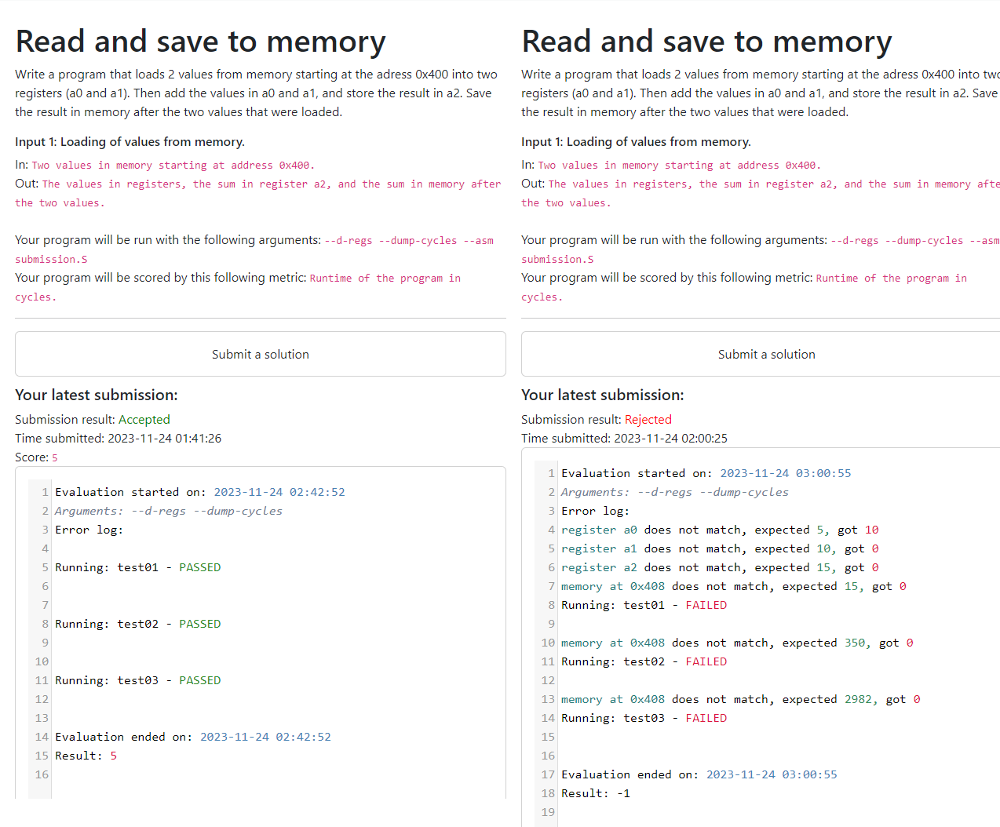
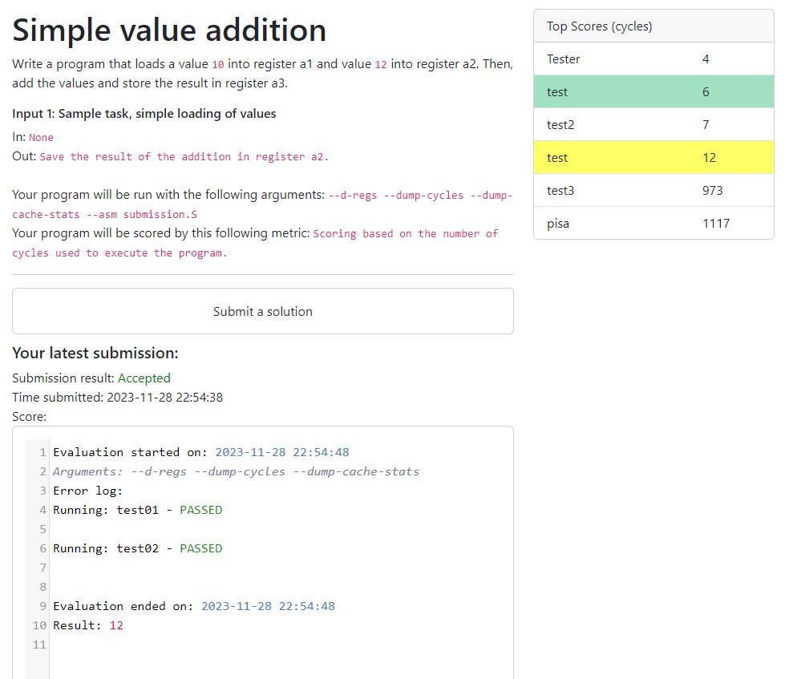

# QtRVSim online evaluation

The app is written in Flask and is using a PostgreSQL database.

Public version is running [here](https://eval.comparch.edu.cvut.cz).

## Roadmap:
- [x] Users are able to register
- [x] Users are able to login
- [x] List of tasks is displayed on the homepage
- [x] Tasks are displayed on their separate pages which the homepage links to
- [x] Logged in users are able to submit solutions on the submit page (with the task number)
- [x] The submission form has a textarea for the task solution (library CodeMirror for assembly highlighting)
- [x] After submitting, the file will be saved in a folder, and a new record will be created in the submission table
- [x] A file will be evaluated and the submission closed, results will be saved in results file
- [x] The results will be displayed on the submission page
- [x] Automatic evaluator, which periodically checks for new submissions and evaluates them
- [x] Find a way to compare the output to the expected output
- [x] Evaluator compares the task output to the reference
- [x] Comparison of reference registers and submission registers
- [x] Comparison of reference memory and submission memory
- [x] On each task page, a leaderboard will be shown with the users best submissions (in cycles), made by a request (to the submissions table) for that task
- [x] Each user will only have the latest submission listed
- [x] Basic app functionality Done?
- [x] Users can view their last submissions (before it gets overwritten by new one of the same task)
- [x] User will see their best score and the their latest submission score in the leaderboard
- [ ] Move qtrsvim into docker container, for security reasons / into an isolate utility
- [X] Delete old, not needed submissions (not the latest and the best for each task and user, other can be deleted)
- [X] Split submission table into pure submissions and results
- [X] Add the starting template file to each task (instead of one template for all tasks)
- [X] Remove the explicit declaration of do_comapare_registers and do_compare_memory, and implicitly set them to True, if the reference registers or memory are set
- [X] Move database info into .env file
- [X] Register confirm email
- [X] Password reset
- [X] Migrate database into PostgreSQL
- [ ] Implement database trigger for evaluator
- [X] Write tasks, same as these: [b35apo](https://cw.fel.cvut.cz/b222/courses/b35apo/homeworks/bonus/start)
- [X] Implement cache settings (first line of the submission code)
- [X] Implement uart communication
- [X] Implement c file submission
- [ ] Correctly implement c syntax highlighting (fix submission.S appearing instead of submission.c)
- [ ] Implement submission viewer
- [ ] Implement admin view for the submissions (permission override)
- [ ] Add profile settings page
- [ ] Add about page
- [ ] Move the whole evaluation into try - catch, if something goes (for some reason) horribly wrong

## Database structure

### Users table
| Field              | Type    | Length | Default        |
|--------------------|---------|--------|----------------|
| id                 | int     | 32     | AUTO_INCREMENT |
| username           | varchar | 128    | None           |
| password           | varchar | 128    | None           |
| email              | varchar | 128    | None           |
| salt               | varchar | 128    | None           |
| verification_code  | varchar | 128    | None           |
| user_verified      | tinyint | 1      | 0              |

Email is a hash of the email adress, so it allows users to send a password to their email adress.

### Submissions table

| Field        | Type       | Length | Default             |
|--------------|------------|--------|---------------------|
| id           | int        | 64     | AUTO_INCREMENT      |
| userid       | int        | 64     | None                |
| taskid       | int        | 64     | None                |
| filepath     | varchar    | 64     | None                |
| evaluated    | tinyint    | 1      | 0                   |
| result       | smallint   | 2      | -1                  |
| result_file  | varchar    | 64     | NULL                |
| score        | int        | 32     | -1                  |
| time         | datetime   | None   | current_timestamp() |

User submits a task -> a submission is created. An evaluator evaluates the tasks in the order they came in the database.
After a task is evaluated, it is marked as evaluated, so it is not evaluated more than one time. An evaluation log is created. The evaluated submissions is deleted from the database, and written into the results table.

Result file 

### Results

| Field        | Type       | Length | Default             |
|--------------|------------|--------|---------------------|
| userid       | int        | 64     | PRIMARY             |
| taskid       | int        | 64     | PRIMARY             |
| result_file  | text       | 64     | NULL                |
| last_source  | text       |        | NULL                |
| score_best   | int        | 32     |                     |
| score_last   | int        | 32     |                     |

User submits a task -> a submission is created. An evaluator evaluates the tasks in the order they came in the database.
After a task is evaluated, it is marked as evaluated, so it is not evaluated more than one time. An evaluation log is created.

### Tasks table

| Field     | Type    | Length | Default        |
|-----------|---------|--------|----------------|
| id        | int     | 64     | AUTO_INCREMENT |
| name      | varchar | 64     | None           |
| path      | varchar | 256    | None           |
| available | tinyint | 1      | 1              |

### Triggers

Triggers have been added for better database management. The triggers are used to delete old submissions, and to update the results table.

Database is running PostgreSQL 16 on port 5432.
Release app is running on a Eval-Comparch VPS [https://eval.comparch.edu.cvut.cz](https://eval.comparch.edu.cvut.cz).

## Task creation
Tasks will be stored in toml format, with structure similar to this one (rewritten it to make it more readable, user friendly).

Basic structure
```toml
[task]
name = "Bubble Sort"
template = "S_templates/bubble.S"

description = '''
# Bubble Sort.
**Write a program that sorts an array using bubble sort algorithm.**

The size of the array will be located at the address `array_size`, the integer array (32-bit integer words) will start
at the address `array_start`.

The program should sort the array in ascending order.
Your program will be tested with different array sizes and different values in the array.
'''

[arguments]
run = "--dump-cycles --cycle-limit 5000"

[[inputs]]
data_in = "Size of the array located at address array_size, the array start is located at the address array_start."
data_out = "Sorted array of length array_size"
description = "Cache optimized sorting."

[[testcases]]
name = "5 elements"

[[testcases.starting_mem]]
array_size = [5]
array_start = [1, 3, 4, 5, 2]

[[testcases.reference_mem]]
array_start = [1, 2, 3, 4, 5]

[[testcases]]
name = "scoring testcase"
private = true

[[testcases.starting_mem]]
array_size = [5]
array_start = [16, 8, 4, 2, 1]

[[testcases.reference_mem]]
array_start = [1, 2, 4, 8, 16]

[score]
description = "Runtime of the program in cycles."
testcase = "scoring testcase"
```
Arguments are passed to the `QtRVSim` object, which is used to run the simulator.

Note that, in order to use the cycles metric, the simulator needs to be run with the `--dump-cycles` argument.

The final evaluation (and the score in cycles) is done by referencing the test name in `score.testcase` section of the task file.

Some other variations of the task file (which are currently implemented) are these:

```toml
[task]
cache_max_size = 16
```
Sets the maximum size and allows the user to set the cache size in the submission file.
This is done by adding a line `#cache:policy,sets,words_in_blocks,ways,write_method` to any line of the submission file. If the setting is done incorrectly (or cache size is set in task file but is not present in the submission file), user will get a cache error.

```toml
[make]
Makefile="""
your makefile will be here
"""
```

If the task cannot be run with the QtRVSim integrated assembler (`--asm` parameter), it can be compiled with a makefile. The makefile needs to compile the `submission.S` target, the executable need to be named `submission`. Please provide a target `clean` to clean your temporary files (compiled sources and such).

If you require another files to be present during the make process, you can add them to the `files` section of the task file. The files will be copied to the user's submission folder at the time of compilation. They will be deleted after the evaluation ends.

```toml
[[files]]
name = "crt0local.S"
code = """
"""
```

If the solucion should be written in C, add a flag `c_solution = true` to the task file.
(this also requires custom makefile, which compiles `submission.c` to `submission`)

```toml
[task]
c_solution = true
```

For serial port communication, use:

```toml
[[testcases.input_uart]]
uart = "112233\n445566\n"

[[testcases.reference_uart]]
uart = "557799\n"
```

## Task evaluation log

The log is saved as a text blob in the database and is displayed on the task page for logged users that already submitted their task. This file is displayed to the user in this way:



The latest score is highlighted in yellow, and the best score is highlighted in green.



A custom styling for CodeMirror has been written to make the log more readable.

## Database config
Database configuration is made in a file `.env`
```python
SECRET_KEY=
MAIL_SERVER=
MAIL_PORT=
MAIL_USE_TLS=False
MAIL_USE_SSL=True
MAIL_USERNAME=
MAIL_PASSWORD=
MAIL_DEFAULT_SENDER=
DB_USER=
DB_PASSWORD=
DB_HOST=localhost
DB_DATABASE=
DB_PORT=5432
```

## Creating a new task

To create a new task, `cd` into the `scripts/` folder and run `tasks.py --create`. The script will automatically create a taskfile, as well as inserting the new task into the database.
More options are available, run `tasks.py --help` for more information.

## Dumping the database

To dump the database, run `scripts/pg_dump.py`. The script will create a dump of the database as a `.sql` file.

## Creating a new database

To create a new database, modify and run the `scripts/create_database.py` script. The script will create a new database and the necessary tables, as well as triggers and a new user.

## Acknowledgements
- [Flask](https://flask.palletsprojects.com/en/3.0.x/)
- [PostgreSQL](https://www.postgresql.org/)
- [CodeMirror](https://codemirror.net/)
- [Bootstrap](https://getbootstrap.com/)
- [QtRVSim](https://github.com/cvut/qtrvsim)
